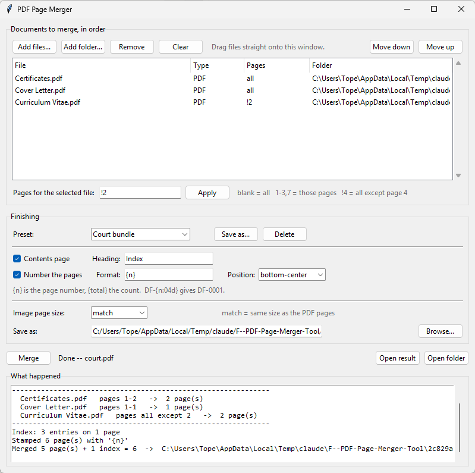

# PDF Page Merger Tool

Drop PDFs, images, Word documents and spreadsheets in, get one merged PDF out.
Reusable — run it as often as you like.

**It never reads the contents of your PDFs.** It copies page objects straight from
the source files into the output file. Nothing is extracted, printed, or logged
except file names and page counts.



## At a glance

A Windows desktop application, about 2,700 lines of Python, with three ways in and
one engine behind them: a window, a watched folder, and a command line. The window
builds the same command line the terminal takes and calls the engine's `main()`
directly, so the two cannot drift apart.

- **Three runtime dependencies** — pypdf, Pillow and cryptography. Word and
  spreadsheet conversion is delegated to whichever of Microsoft Office or
  LibreOffice is on the machine, over COM or the command line.
- **227 tests**, about 1,500 lines, covering the page-range grammar, contents-page
  pagination, stamping, image sizing, encrypted PDFs, settings corruption and
  whole merges end to end. The build runs them first and refuses to package on a
  failure.
- **Ships as a signed installer** built from its own pinned interpreter, so the
  machine it is built on cannot leak into the artifact. PyInstaller plus Inno
  Setup, driven by one PowerShell script.
- **Licence compliance is generated, not remembered.** The notices file is
  rebuilt from the licence texts actually installed on every build, and tests
  assert that every bundled package and DLL appears in it.

### Things in here that were more interesting than expected

- **The contents page and page numbers are written as raw PDF source** — real
  cross-reference table and all — because pypdf cannot draw text and reportlab is
  not worth a dependency. Helvetica is one of the 14 fonts every reader has, so
  nothing is embedded and an index page costs about a kilobyte.
- **A contents page has to settle its own length before layout**, because it
  shifts every page after it, including the numbers printed on itself.
- **Drag-and-drop is raw Win32** — `WM_DROPFILES` subclassed through `ctypes`,
  rather than a third-party package, so a customer never has to install anything.
- **Office automation is hostile.** Capturing its output deadlocks the merge;
  Excel suspends its object model after an export; killing it leaves
  crash-recovery entries that poison later runs. `PROJECT-NOTES.md` records each
  of those and why the code is shaped around them.

## Running it from source

```powershell
.python\python.exe -m pytest                 # the test suite
.python\python.exe merge.py --help           # the command line
.\Merge GUI.bat                              # the window
.\packaging\build.ps1 -SkipSign             # build the installer, unsigned
```

`.python\` is a self-contained interpreter for this project, rebuilt from
`requirements-build.txt`. [PROJECT-NOTES.md](PROJECT-NOTES.md) explains why it is
not the one on `PATH`, along with every other decision and the bugs that shaped
them; [packaging/README.md](packaging/README.md) covers building and releasing.

## Licence

**All rights reserved.** There is deliberately no open-source licence file: the
source is published so it can be read and assessed, not so it can be reused. If
you want to do something with it, ask.

The program itself is supplied to users under written licence terms, which the
installer presents on an accept-or-decline page and which are issued with each
order. They are not published here, because they have to identify the
contracting party by registered office; ask and you will be sent them. [THIRD-PARTY-NOTICES.txt](THIRD-PARTY-NOTICES.txt) carries
the licences of the open-source components it is built from — those are of course
theirs, not mine, and nothing above affects them.

## Folder layout

```
PDF Page Merger Tool\
  input\              <- put your PDFs, images, Word docs and sheets here
  output\             <- merged.pdf lands here
  merge.py            <- the engine, and the command line
  merge_gui.pyw       <- the window
  Merge GUI.bat       <- double-click launcher for the window
  Merge.bat           <- double-click launcher for the input\ folder
  docs\order.txt.example  <- copy to order.txt for exact control
  settings.json       <- the window's saved preferences (created on first use)
  packaging\          <- build a signed installer (see packaging\README.md)
  PROJECT-NOTES.md    <- why it is built the way it is, and what is still open
  THIRD-PARTY-NOTICES.txt  <- licences of the components it is built from
  tests\              <- the test suite:  .python\python.exe -m pytest
```

## The window version

Double-click **Merge GUI.bat**. Then **drag files and folders straight onto the
window** — or use Add files / Add folder. Set the order, give any file a page
range, tick the contents page and numbering, press Merge. It runs the same engine
as everything below and shows you exactly what it did.

Dropping a folder adds everything usable inside it, in natural name order.
Anything it can't merge is refused as it lands, with a note, rather than failing
later mid-merge. Files dropped onto `Merge GUI.bat` itself are listed at startup.


Everything the command line can do, the window does too, because it builds the
same command and hands it to the same code — there is one merging engine here,
not two.

Drag and drop uses the Windows shell's own `WM_DROPFILES`, so there is no
drag-and-drop package to install: copy this folder to another Windows machine and
it just works. On anything other than Windows the buttons still do the job.

### Presets for the bundles you make often

The **Preset** row at the top of Finishing holds named sets of finishing options —
contents page and heading, stamp format and position, image page size. Pick one
and everything below it is set at once.

Four come ready to use, and you can change or delete any of them:

| Preset | Contents page | Numbering |
|--------|---------------|-----------|
| Court bundle | yes, headed "Index" | `1`, `2`, `3`, bottom centre |
| Bates numbered | no | `ABC-00001`, bottom right |
| Candidate pack | yes, headed "Contents" | `Page 3 of 12`, bottom right |
| Plain merge | no | none |

**Save as...** stores the current options under a name of your choosing —
"Trial bundle (A4)", "Client pack", whatever you actually make. Saving over an
existing name asks first, and **Delete** removes one.

A preset covers *how* a bundle is finished, never which files go into it or where
it is saved, since those change every job. Change any option by hand and the
preset name clears, so the box never claims a preset that no longer describes
what is set.

Delete every preset and the starting four come back next time, so you can't end
up with an empty list.

### It remembers how you like it

Your stamp format, stamp position, contents-page heading, image page size, output
location, whether each option is ticked, your presets, and the window size are all
saved to `settings.json` next to the tool — written when you close the window and again
after every successful merge, so a good run is never lost. Set `DF-{n:05d}` once
and it is still there tomorrow.

The file sits beside the tool so your settings travel with the folder when you
copy it. If the folder is ever read-only — installed under `Program Files`, say —
it falls back to `%APPDATA%\PDF Page Merger\settings.json` instead. Delete the
file to go back to the defaults; it is plain JSON, and anything in it that does
not make sense is ignored rather than breaking the window.

Settings belong to the window only. The command line stays explicit, so scripts
and scheduled jobs always do exactly what their arguments say.

Because the window always overwrites its output, it asks before replacing a file
it did not create itself. Once it has written a file in that session, it stops
asking.

## The 10-second version, without the window

1. Copy your PDFs, images, Word documents and spreadsheets into `input\`
2. Double-click **Merge.bat**
3. Collect `output\merged.pdf`

Files are merged in natural name order, so `page2.pdf` comes before `page10.pdf`.
Prefix names with `01_`, `02_`, `03_` when you want a specific order.

## Exact control: order.txt

Copy `order.txt.example` to `order.txt` and list your sources, one per line,
top to bottom. When `order.txt` exists, it wins over the folder scan.

```
cover.jpg
letter.docx
report.pdf:1-3,7
budget.xlsx
signed page.png
appendix.pdf:5-
C:\Users\you\Pictures\receipt.tiff:2
```

Bare file names are looked up in `input\`. Absolute paths work too. The same file
can appear as many times as you want.

### Page ranges

| Spec | Meaning |
|------|---------|
| `file.pdf` | every page |
| `file.pdf:3` | just page 3 |
| `file.pdf:2-5` | pages 2 through 5 |
| `file.pdf:7-` | page 7 to the end |
| `file.pdf:-4` | start through page 4 |
| `file.pdf:1-3,7,10-` | combine with commas |

Page numbers are 1-based and inclusive.

### Removing pages

Put `!` in front and it means the opposite — everything *except* those pages.
Handy when you want to drop a page or two from a long document and don't want to
work out the ranges either side of the gap.

| Spec | Meaning |
|------|---------|
| `file.pdf:!7` | every page except page 7 |
| `file.pdf:!2-4` | every page except 2, 3 and 4 |
| `file.pdf:!1,3,5` | drop those three, keep the rest |

`~` does the same thing (`file.pdf:~7`) and is easier to type in shells where `!`
means something — Git Bash, for instance. In PowerShell and `Merge.bat` either
works.

Your original file is never modified. To trim a PDF, merge it by itself:

```bash
python merge.py "report.pdf:!7" -o trimmed.pdf
```

Keep-lists and exclusions don't mix in one spec — `!` applies to the whole file.
A keep-list is the one that reorders and repeats (`file.pdf:6,1,1`); an exclusion
always leaves the surviving pages in their original order. If you need both, do
it in two runs, or list the keeps explicitly.

## Images

Images are merged in exactly the same way as PDFs — list them, order them, mix
them with PDF pages. Each image becomes one page.

Supported: **jpg, jpeg, png, gif, bmp, tif, tiff, webp, jfif, ppm, pgm**.

- **Page size matches your PDF pages.** By default an image page is given the same
  size as the PDF pages it's being merged with, so the finished document is one
  consistent size throughout — A4 in, A4 out. If the PDFs disagree, the most
  common size wins. Each image is centred on that page with a 0.25" border, and
  a landscape image is fitted inside it rather than turning the sheet sideways,
  since the point is to match.

  The run prints what it picked, e.g. `Image pages: 8.27 x 11.69 in (A4) - matching the PDF pages`.

  Override with `--image-page letter` / `a4` / `legal` — these use a fixed sheet
  and *do* turn it sideways for landscape images — or `--image-page exact`, which
  makes the page exactly the size of the image, no border and no whitespace.
  With images and no PDFs at all, it falls back to US Letter.
  Adjust the border with `--image-margin 0` (inches).
- **Phone photos come out upright.** EXIF rotation is applied, so a sideways
  photo isn't a sideways page.
- **Transparent PNGs** are flattened onto white rather than turning black.
- **Multi-page TIFFs and GIFs** count as several pages, so `scan.tiff:2-3` works
  just like a PDF range.
- **HEIC** (iPhone photos) needs one add-on: `python -m pip install pillow-heif`.
  Until then those files are skipped with a note. Alternatively, set your iPhone
  to *Settings → Camera → Formats → Most Compatible* to get JPGs.
- `--pdf-only` ignores images when scanning a folder.
- **Encrypted PDFs** mostly just work. A document secured against editing rather
  than reading needs nothing from you -- the tool tries an empty password first,
  which is what those files are. One that genuinely needs a password to open is
  skipped with a note unless you supply it: `--password` on its own asks for it
  without showing it, which keeps it out of your shell history and out of the
  process list. In the window, use the **Password...** button; passwords there
  are held for that session only, never saved and never written to the log.

For `--image-page exact`, the page size comes from the image's own DPI, falling
back to 150 DPI when it has none. Override with `--image-dpi 300`.

## Word documents and spreadsheets

`.docx`, `.doc`, `.docm`, `.rtf`, `.odt` and `.xlsx`, `.xlsm`, `.xlsb`, `.xls`,
`.csv`, `.ods` are merged like everything else — list them, order them, give them
page ranges (`report.docx:1-3`). They are converted to PDF behind the scenes and
the temporary copies are deleted when the merge finishes.

- **Microsoft Office does the conversion**, so the result looks exactly like
  Office's own "Save as PDF" — fonts, headers, tables, page breaks. Everything in
  one merge is converted in a single Word session and a single Excel session.
- **LibreOffice is the fallback**, picked up from `PATH`. If Office can't be
  started, the tool switches to LibreOffice by itself and says so. Force one with
  `--converter office` or `--converter libreoffice`; if it's ever somewhere off
  `PATH`, point at it with `--soffice "D:\LibreOffice"` or a `SOFFICE`
  environment variable.
- **Nothing needs to be closed first.** If you already have Word or Excel open,
  the tool borrows the session and leaves it running — it only shuts down an
  instance it started itself. LibreOffice conversions run in a private throwaway
  profile, so they never disturb documents you have open there (without that,
  LibreOffice hands the job to your running copy, which can silently convert
  nothing and leaves locks on your input files).
- **Macros are disabled** before any document is opened.
- **Page numbers follow the converted document**, so `report.docx:2-4` means
  pages 2 to 4 as Word lays them out. Run `--list` first if you're unsure how
  many pages a document produces.
- `--keep-converted` leaves the intermediate PDFs on disk and prints where, which
  is handy if a document doesn't come out looking the way you expected.
- `--pdf-only` skips Word and Excel files entirely.

### Spreadsheet layout

A spreadsheet is printed the way the workbook itself is set up, which is what
Excel would give you — and which, for a wide sheet that has never been print-
configured, means columns spilling across many pages. Two switches fix that:

| Switch | Result |
|--------|--------|
| `--excel-fit as-is` | the workbook's own print setup (default) |
| `--excel-fit width` | every sheet squeezed to one page wide, as many pages tall as needed |
| `--excel-fit page` | every sheet forced onto a single page |

A 30-column test sheet came out as 8 pages `as-is` and 1 page with
`--excel-fit width`. All sheets in the workbook are exported, not just the
active one, and `.csv` files are converted the same way.

`--excel-fit` only applies when **Excel** does the converting — it works by
changing the print setup before exporting, which LibreOffice has no equivalent
for. Under LibreOffice the workbook's own settings are used and the switch is
ignored. Set the print area and "Fit to 1 page wide" in the workbook itself if
you need that layout to survive either converter.

## Bundles: contents page and page numbering

Two switches turn a merge into a finished, navigable document.

```bash
python merge.py --index --stamp "DF-{n:04d}"
```

**`--index`** puts a contents page in front, listing every source file against the
page it starts on, with dot leaders and right-aligned page numbers. The listing
accounts for its own length, so the numbers are right even when the index itself
runs to two or three pages. Long file names are trimmed with an ellipsis rather
than colliding with the number column. The page is created at the same size as
the rest of the document.

| Switch | Purpose |
|--------|---------|
| `--index` | add the contents page |
| `--index-title "Bundle Index"` | heading text (default: `Contents`) |
| `--index-size 10` | type size for entries |
| `--index-title-size 17` | type size for the heading |
| `--index-leading 18` | line spacing |
| `--index-margin 1.0` | margin, in inches |

**`--stamp`** numbers every page, index included, so the printed numbers agree
with the contents page. `{n}` is the page number and `{total}` the count:

| Command | Stamp |
|---------|-------|
| `--stamp` | `1`, `2`, `3` … |
| `--stamp "Page {n} of {total}"` | `Page 3 of 12` |
| `--stamp "DF-{n:05d}"` | `DF-00003` — Bates style |
| `--stamp --stamp-start 100` | starts at `100` |

Position it with `--stamp-at bottom-right` (default), `bottom-center`,
`bottom-left`, `top-right`, `top-center` or `top-left`; size it with
`--stamp-size 9`; move it in or out from the edge with `--stamp-margin 0.5`
(inches).

Bookmarks are still added per source, and they stay in step with the contents
page — both point at the same page.

The text is drawn using Helvetica, one of the fonts every PDF reader already has,
so nothing is embedded and the added pages cost about a kilobyte.

## Command line

```bash
python merge.py
```

| Command | What it does |
|---------|--------------|
| `python merge.py` | merge `input\` (or follow `order.txt`) |
| `python merge.py a.pdf scan.jpg letter.docx` | merge just those files |
| `python merge.py "report.docx:1-3" cover.png` | pick pages, set order |
| `python merge.py "report.pdf:!7" -o trimmed.pdf` | remove page 7 from a PDF |
| `python merge.py --index --stamp` | contents page + numbered pages |
| `python merge.py --stamp "DF-{n:05d}"` | Bates-style numbering |
| `python merge.py --list` | dry run — print the plan, write nothing |
| `python merge.py -o final.pdf` | choose the output name |
| `python merge.py -i "C:\Scans"` | scan a different folder |
| `python merge.py -r` | include subfolders |
| `python merge.py -f` | overwrite the output instead of versioning |
| `python merge.py --no-bookmarks` | skip the per-source bookmarks |
| `python merge.py --pdf-only` | ignore images and Word docs when scanning a folder |
| `python merge.py --keep-converted` | keep the PDFs made from Word/Excel files |
| `python merge.py --converter libreoffice` | force a particular converter |
| `python merge.py --soffice "D:\LibreOffice"` | say where LibreOffice lives, if not on `PATH` |
| `python merge.py --excel-fit width` | squeeze wide sheets to one page wide |
| `python merge.py --password` | ask for a password for an encrypted PDF, without showing it |
| `python merge.py --password SECRET` | give one outright (it will be visible in your shell history) |
| `python merge.py --password-file pw.txt` | read passwords from a file, one per line |
| `python merge.py --image-page a4` | force a fixed sheet for images instead of matching |
| `python merge.py --image-page exact` | size image pages to the image itself |
| `python merge.py --image-margin 0` | no white border around images |
| `python merge.py --image-dpi 300` | resolution for `exact` image pages |

`Merge.bat` also accepts dragged-and-dropped files: drop a selection of PDFs,
images, Word documents and spreadsheets onto it and they get merged in the order
Windows hands them over.

## Good to know

- **Nothing is overwritten.** A second run produces `merged-2.pdf`, then
  `merged-3.pdf`, and so on. Use `-f` if you'd rather replace `merged.pdf`.
- **Bookmarks.** Each source file becomes a bookmark in the merged PDF, named
  after the file, so you can jump between sections. Turn off with `--no-bookmarks`.
- **Problem files are skipped, not fatal.** A missing, corrupt, or
  password-protected PDF — or a Word document that won't convert — is reported at
  the end; everything else still merges.
- **Requirements:** Python 3.9+, `pypdf`, and `pillow` for images — all already
  installed here. On another machine: `python -m pip install pypdf pillow`
  (Pillow is only loaded when an image is actually in the merge.)
  Word documents and spreadsheets additionally need Microsoft Office or
  LibreOffice installed; no Python package is required for that, and nothing is
  needed at all if you're only merging PDFs and images. Both are present on this
  machine: Office 16.0, and LibreOffice 26.2 on `PATH` via
  `D:\LibreOffice\program`.

## Making an installer

`packaging\` holds everything needed to turn this folder into a signed installer
that carries its own Python, so the machine it lands on needs nothing installed:

```powershell
.\packaging\build.ps1 -SkipSign                                  # check it builds
.\packaging\build.ps1 -CertificateThumbprint A1B2C3...           # the real thing
```

It needs PyInstaller and Inno Setup, neither of which is installed here yet.
Signing needs no extra tooling — that part is built into Windows. See
[packaging\README.md](packaging/README.md) for what to install, how to get a
certificate, and why both the programs *and* the installer must be signed.

An installed copy notices that its own folder is read-only and adapts: merged
files default to `Documents\PDF Page Merger\`, and settings go to
`%APPDATA%\PDF Page Merger\`. Copy the folder somewhere writable instead and it
stays self-contained, exactly as it is now.

## Exit codes

`0` merged cleanly · `1` nothing to merge · `2` merged, but some sources were skipped
